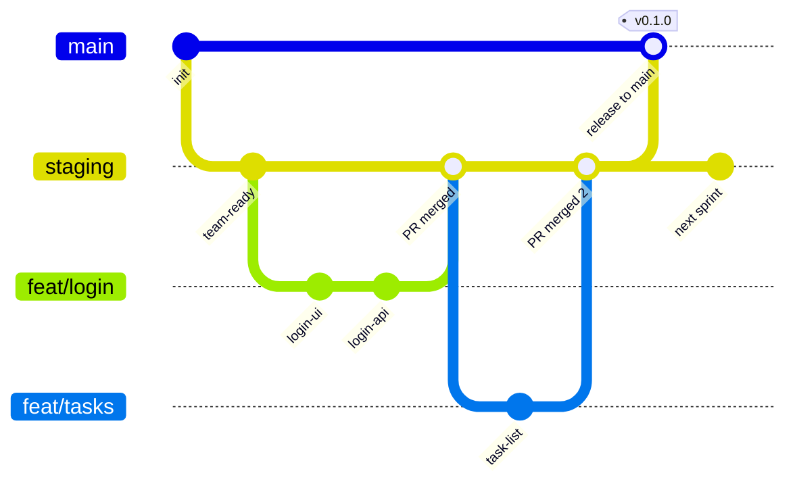

# Git flow — branch timeline

A second view of how branches move over time.

## Legend

| Symbol | Meaning |
|--------|---------|
| `feat/*` branch | One person's task; deleted after merge |
| Merge into `staging` | Normal daily integration |
| Merge `staging` → `main` | Release to production |

## Who does what

| Person | Typical action |
|--------|----------------|
| Developer | `feat/*` → PR → `staging` |
| Reviewer | Approve PR, check Qodo + CI |
| Release owner | `staging` → PR → `main` |

Full commands: [git-workflow-beginner.md](../git-workflow-beginner.md)
