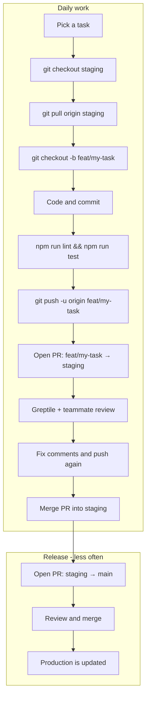

# Git workflow for beginners

This guide explains how **you and your coworker** should use Git and GitHub on this project.

**Rule in one sentence:** Start from `staging`, work on a short-lived branch, open a PR to `staging`, then release `staging` → `main` when ready.

---

## Visual overview



See also: [diagrams/git-flow-overview.md](diagrams/git-flow-overview.md) for a branch timeline view.

---

## Branches (what they mean)

| Branch | Meaning | Can I push directly? |
|--------|---------|----------------------|
| `main` | Live / production-ready code | **No** — PR only |
| `staging` | Testing ground for the team | **No** — PR only |
| `feat/...`, `fix/...`, `chore/...` | Your work for one task | **Yes** — this is your branch |

We do **not** use permanent personal branches like `herman-work` or `coworker-work`. Those get messy. Everyone uses task branches.

---

## Step-by-step: starting a new task

### 1. Update `staging`

```bash
git checkout staging
git pull origin staging
```

### 2. Create your branch

```bash
git checkout -b feat/add-settings-page
```

Use names like:

- `feat/...` — new feature
- `fix/...` — bug fix
- `chore/...` — docs, tooling, cleanup

### 3. Work and commit often

```bash
# after saving changes
git add .
git commit -m "feat: add settings page layout"
```

Small commits are good. Push regularly:

```bash
git push -u origin feat/add-settings-page
```

---

## Step-by-step: opening a pull request

### 1. Run checks locally

```bash
npm run lint
npm run test
npm run dev   # click through your change
```

### 2. Clean up your code (optional but recommended)

If you used an AI agent for a large change, run the **code-simplifier** skill in Cursor to tidy up recently modified files without changing behavior.

Local copy: `.cursor/skills/code-simplifier/SKILL.md`

### 3. Open PR on GitHub

- **Base branch:** `staging` (not `main`)
- **Compare branch:** your `feat/...` branch
- Fill in the PR template checklist

### 4. Greptile review

[Greptile](https://www.greptile.com/docs/introduction) automatically reviews your PR in about 3 minutes.

- Read each comment.
- Fix real issues and push again (Greptile re-reviews).
- Use 👍/👎 on comments so Greptile learns your team's style.
- If Greptile suggests a fix, you can use **Fix with your Agent** (Cursor, etc.) when available.

#### Agent skills for Greptile feedback

| Skill | When to use | How |
|-------|-------------|-----|
| **check-pr** | First check after opening PR or after pushing fixes | Ask Cursor: "run check-pr" — triages CI, Greptile comments, and description |
| **greploop** | Greptile still has many comments or confidence below 5/5 | Ask Cursor: "run greploop" — loops fix → push → re-review until clean |
| **code-simplifier** | Code works but the diff is messy | Ask Cursor: "run code-simplifier" — cleans up without changing behavior |

Skills live in `.cursor/skills/<name>/SKILL.md`. Requires `gh` CLI authenticated (`gh auth login`).

**Typical flow:**
1. Open PR → wait for Greptile (~3 min)
2. Run **check-pr** to see what's actionable
3. Fix issues, push again
4. If Greptile still has multiple rounds of feedback → run **greploop**
5. Run **code-simplifier** before final human review if needed

### 5. Human review

Ask your coworker to review. When checks pass and review is approved → **Merge**.

Use **Squash merge** if GitHub offers it (one clean commit on `staging`).

---

## Releasing to production (`staging` → `main`)

Do this when `staging` is tested and ready — not after every small PR.

```bash
git checkout staging
git pull origin staging
```

On GitHub:

1. New PR: **base `main`**, **compare `staging`**
2. Title: `release: promote staging to main`
3. Review, merge when ready

See [checklists/release-checklist.md](checklists/release-checklist.md).

---

## Fixing merge conflicts

If GitHub says your branch is behind `staging`:

```bash
git checkout feat/your-branch
git fetch origin
git merge origin/staging
# fix conflicted files in your editor
git add .
git commit -m "chore: merge staging into feat branch"
git push
```

---

## Common mistakes

| Mistake | Fix |
|---------|-----|
| Opened PR to `main` instead of `staging` | Close PR, reopen with base = `staging` |
| Forgot to pull `staging` before branching | `git checkout staging && git pull` then merge into your branch |
| Pushed to `staging` directly (blocked) | Create a branch and open a PR instead |
| Greptile comment seems wrong | Reply explaining why; use 👎 to train it |
| `VITE_CONVEX_URL` missing locally | Run `npm run dev:backend`, copy URL to `frontend/.env.local` |

---

## References and tools

| Resource | Link | When to use |
|----------|------|-------------|
| Architecture | [starter-architecture.md](starter-architecture.md) | How the stack fits together |
| Greptile | [Introduction](https://www.greptile.com/docs/introduction) | Every PR — automatic AI review |
| check-pr / greploop | `.cursor/skills/` | PR readiness and Greptile fix loops |
| code-simplifier | `.cursor/skills/code-simplifier/` | Clean up code before review |
| Convex | [Docs home](https://docs.convex.dev/home) | Backend, schema, queries |
| TanStack | [tanstack.com](https://tanstack.com/) | Router, Start, Query |
| shadcn/ui | [ui.shadcn.com](https://ui.shadcn.com/) | UI components |
| opensrc | [opensrc-workflow.md](opensrc-workflow.md) | Fetch npm/repo source for AI agents |
| code-structure | `.cursor/skills/code-structure/` | Refactoring shared logic into services |

### opensrc quick start

Fetch upstream source for stack packages (stored locally under `opensrc/repos/github.com/`):

```bash
npx opensrc fetch get-convex/convex-backend
npx opensrc fetch TanStack/router
rg "runQuery" opensrc/repos/github.com/get-convex/convex-helpers/
```

See [opensrc-workflow.md](opensrc-workflow.md) and [stack-source-repos.md](stack-source-repos.md).

---

## Checklists

- [Starting work](checklists/pr-checklist.md#starting-work)
- [Before opening PR](checklists/pr-checklist.md#before-opening-a-pr)
- [Reviewing a PR](checklists/pr-checklist.md#reviewing-a-teammates-pr)
- [Release day](checklists/release-checklist.md)
