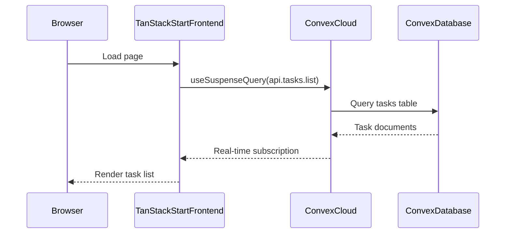
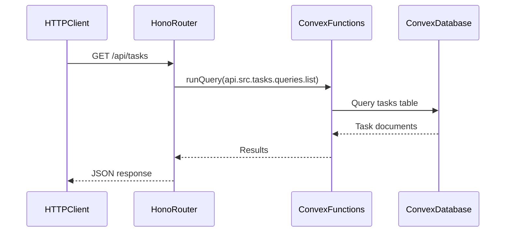
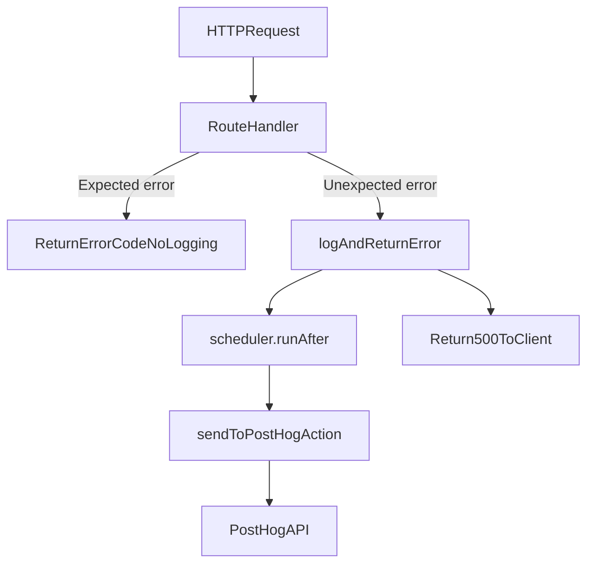

# Workbench starter architecture

This document explains how the Workbench monorepo is structured, how data flows between layers, and how the pieces fit together for beginners and AI agents.

## Overview

Workbench is a full-stack starter with:

| Layer | Technology | Location |
|-------|-----------|----------|
| Frontend | TanStack Start (React, SSR) | `frontend/` |
| UI components | shadcn/ui + Tailwind CSS v4 | `frontend/src/components/ui/` |
| Backend | Convex (database, queries, mutations) | `backend/convex/` |
| HTTP API | Hono + OpenAPI + Scalar | `backend/convex/http.ts` |
| Error logging | PostHog (optional) | `backend/convex/src/internal/logging/` |

## Monorepo layout

```
workbench/
├── frontend/                    # TanStack Start app
│   ├── src/
│   │   ├── routes/              # File-based routing (page assembly)
│   │   ├── features/            # Feature components and hooks
│   │   │   └── tasks/           # Example: TaskList, useTasks
│   │   ├── components/
│   │   │   ├── app/             # App-wide shells (PageShell, etc.)
│   │   │   └── ui/              # shadcn/ui primitives
│   │   └── lib/                 # Shared frontend utilities
│   └── components.json          # shadcn configuration
├── backend/
│   └── convex/                  # Convex functions root
│       ├── schema.ts            # Database schema
│       ├── http.ts              # Hono HTTP router entry
│       ├── tasks.ts             # Compatibility re-export
│       └── src/
│           ├── _shared/         # Error codes, HTTP schemas
│           ├── internal/        # Background actions (logging)
│           └── tasks/           # Feature: queries, mutations, http
├── docs/                        # Team guides
├── .cursor/skills/              # Agent skills (Qodo, code-simplifier, etc.)
├── opensrc/                     # Local source cache (gitignored)
└── convex.json                  # Points CLI to backend/convex
```

## Data flow

### Real-time path (frontend → Convex)

This is the primary path for the UI. The frontend uses TanStack Query with the Convex adapter to subscribe to live data.



**Key files:**
- `frontend/src/routes/index.tsx` — home page assembly
- `frontend/src/features/tasks/hooks/use-tasks.ts` — Convex query wiring
- `frontend/src/features/tasks/components/task-list.tsx` — task list UI
- `backend/convex/src/tasks/queries.ts` — `list` query
- `backend/convex/schema.ts` — `tasks` table definition

The frontend imports Convex generated types via the `@convex/*` path alias (see `frontend/tsconfig.json`).

### HTTP API path (external clients → Hono → Convex)

For REST clients, webhooks, or third-party integrations, the Hono HTTP layer exposes documented endpoints.



**Key files:**
- `backend/convex/http.ts` — main router, OpenAPI, Scalar docs
- `backend/convex/src/tasks/http.ts` — task HTTP endpoints
- `backend/convex/src/_shared/errorCodes.ts` — consistent error responses

**API documentation URLs** (when Convex dev is running):

| URL | Purpose |
|-----|---------|
| `/api/openapi` | OpenAPI spec (JSON) |
| `/api/scalar` | Scalar interactive docs UI |
| `/api/tasks` | List all tasks |
| `/api/tasks/:id` | Get task by ID |
| `POST /api/tasks` | Create a task |
| `POST /api/tasks/:id/toggle` | Toggle completion |
| `DELETE /api/tasks/:id` | Delete a task |

### Error handling and logging



- **Expected errors** (404, validation): returned directly, no logging.
- **Unexpected errors** (500): logged to PostHog in the background via `scheduler.runAfter`, then returned to client.

Configure in Convex dashboard → Environment Variables:
- `POSTHOG_API_KEY` (optional)
- `POSTHOG_ENDPOINT` (optional, defaults to US endpoint)

## Adding a new feature

Follow the feature-folder pattern:

```
backend/convex/src/<feature>/
├── queries.ts      # Read operations
├── mutations.ts    # Write operations
└── http.ts         # HTTP endpoints (optional)
```

Then register HTTP routes in `backend/convex/http.ts`:

```typescript
app.basePath('/api').route('/', myFeatureRouter)
```

On the frontend, add a route file in `frontend/src/routes/` and place feature UI in `frontend/src/features/<feature>/`. Compose shadcn components from `@/components/ui/` and app shells from `@/components/app/`.

### Route module export contract

TanStack Start automatically code-splits route modules. Extra **runtime** exports from a route file prevent that split and inflate the shared bundle.

**Rules:**
- Route modules under `frontend/src/routes/` export only `Route` at runtime.
- Type-only exports (for example `export type RootRouterContext`) are allowed.
- Keep page/layout implementations **module-private** when they are not shared.
- Move reusable or independently tested shells/gates to `frontend/src/routes/-components/` (the `-` prefix excludes them from the route tree).
- Move domain page containers and UI to `frontend/src/features/<feature>/`.

Regression coverage lives in `frontend/src/routes/route-export-contract.test.ts`.

## Local development lifecycle

```bash
# Terminal 1: Convex backend (syncs functions, starts HTTP API)
npm run dev:backend

# Terminal 2: Frontend (TanStack Start on port 3000)
npm run dev:frontend

# Or both together:
npm run dev
```

**First-time setup:**
1. Run `npm run dev:backend` and log in with GitHub.
2. Copy the deployment URL to `frontend/.env.local` as `VITE_CONVEX_URL`.
3. Optionally import sample data: `npm --prefix backend exec convex import --table tasks backend/sampleData.jsonl`.

## Git and release flow

```
feat/my-task → staging (PR + review) → main (release PR)
```

See [git-workflow-beginner.md](git-workflow-beginner.md) for the full beginner guide.

## Agent skills

| Skill | When to use |
|-------|-------------|
| `check-pr` | One-shot PR readiness check (CI, Qodo findings, description) |
| `qodo-loop` | Loop until Qodo Action required is clear and CI passes |
| `code-simplifier` | Clean up recently modified code before opening PR |
| `code-structure` | Refactoring shared logic into service layer |
| `frontend-component-architecture` | Component placement, shadcn usage, feature folders |

Skills live in `.cursor/skills/<name>/SKILL.md`.

## Source code reference

Use [opensrc](opensrc-workflow.md) to fetch upstream source for stack packages. See [stack-source-repos.md](stack-source-repos.md) for the canonical repo list.

## Related docs

- [starter-decisions.md](starter-decisions.md) — stack choices and defaults
- [git-workflow-beginner.md](git-workflow-beginner.md) — Git workflow for beginners
- [checklists/pr-checklist.md](checklists/pr-checklist.md) — PR checklist
- [opensrc-workflow.md](opensrc-workflow.md) — fetching dependency source
- [stack-source-repos.md](stack-source-repos.md) — upstream repo inventory
